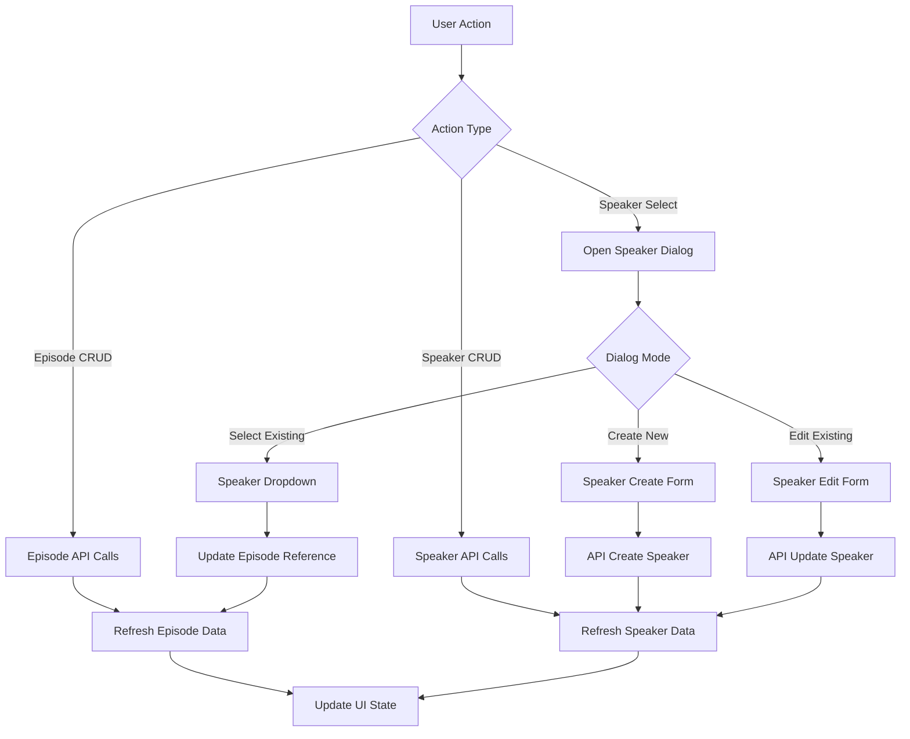

# Podcast Page UX Redesign - Architecture Document

## 🏗️ **High-Level System Overview**

### **Before (Current State)**
```
┌─────────────────────────────────────────┐
│              Podcast Page                │
├─────────────────────────────────────────┤
│ ┌─────────────────┐ ┌─────────────────┐ │
│ │ Tab: Episodes   │ │ Tab: Speakers   │ │
│ │ • Episode List  │ │ • Complex forms │ │
│ │ • Status        │ │ • Session state │ │
│ │ • Audio Player  │ │ • Inline edit   │ │
│ └─────────────────┘ └─────────────────┘ │
│           ┌─────────────────┐           │
│           │ Tab: Ep Profiles│           │
│           │ • Dropdown deps │           │
│           │ • Complex forms │           │
│           └─────────────────┘           │
└─────────────────────────────────────────┘
```

### **After (Target State)**
```
┌─────────────────────────────────────────┐
│              Podcast Page                │
├─────────────────────────────────────────┤
│ ┌─────────────────┐ ┌─────────────────┐ │
│ │ Tab: Episodes   │ │Tab: Templates   │ │
│ │ • Episode List  │ │ ┌─────────────┐ │ │
│ │ • Status        │ │ │   Header    │ │ │
│ │ • Audio Player  │ │ │ Explanation │ │ │
│ │ (unchanged)     │ │ └─────────────┘ │ │
│ └─────────────────┘ │ ┌───────┐┌────┐ │ │
│                     │ │Episode││Spk │ │ │
│                     │ │Profile││Pro │ │ │
│                     │ │ Area  ││Side│ │ │
│                     │ │       ││bar │ │ │
│                     │ └───────┘└────┘ │ │
│                     └─────────────────┘ │
└─────────────────────────────────────────┘
           ↕ st.dialog
┌─────────────────────────────────────────┐
│         Speaker Configuration          │
│ • Create/Edit Form                     │
│ • Dynamic speaker count               │
│ • Model selection                     │
└─────────────────────────────────────────┘
```

## 🔧 **Affected Components and Dependencies**

### **Primary File to Modify**
- `pages/5_🎙️_Podcasts.py` - Complete restructure with new layout

### **External Dependencies (No Changes)**
- `api/routers/speaker_profiles.py` - Existing CRUD endpoints
- `api/routers/episode_profiles.py` - Existing CRUD endpoints  
- `open_notebook/domain/podcast.py` - Data models and validation
- `api/models_service.py` - Model provider/type management

### **Session State Dependencies**
- Current session state keys that will be modified/removed
- New session state structure for dialog management

## 📱 **New Component Structure**

### **Main Layout Components**

```python
def render_podcast_page():
    """Main page orchestrator"""
    episodes_tab, templates_tab = st.tabs(["Episodes", "Templates"])
    
    with episodes_tab:
        render_episodes_section()  # Keep existing functionality
    
    with templates_tab:
        render_header_section()
        col_main, col_side = st.columns([3, 1])
        with col_main:
            render_episode_profiles_section()
        with col_side:
            render_speaker_profiles_sidebar()

def render_episodes_section():
    """Episodes list - keep existing functionality unchanged"""
    
def render_header_section():
    """Explanatory header about relationships and workflow"""
    
def render_episode_profiles_section():
    """Main focus: Episode profiles CRUD with inline speaker info"""
    
def render_speaker_profiles_sidebar():
    """Secondary: Speaker profiles overview with usage indicators"""
```

### **Dialog Components**

```python
@st.dialog("Configure Speaker Profile", width="large")
def speaker_configuration_dialog(mode="create", profile_id=None, episode_context=None):
    """Unified dialog for speaker profile create/edit"""
    # Mode: "create" | "edit" | "select_for_episode"
    
@st.dialog("Confirm Delete")
def confirm_delete_dialog(item_type, item_id, item_name):
    """Reusable confirmation dialog"""
```

### **Data Flow Architecture**



## 🔄 **Session State Management Strategy**

### **Current Session State (To Remove)**
```python
# Complex nested speaker editing states
st.session_state.new_speakers = [...]
st.session_state.edit_speakers_{profile_id} = [...]
st.session_state.edit_speaker_{profile_id} = True/False
st.session_state.edit_episode_{profile_id} = True/False
```

### **New Session State (Simplified)**
```python
# Dialog state management
st.session_state.dialog_mode = "create" | "edit" | "select"
st.session_state.dialog_target_id = profile_id | None
st.session_state.episode_context = episode_id | None  # When selecting speaker for episode

# Temporary form data (only while dialog open)
st.session_state.dialog_speakers = [...]  # Cleared on dialog close
st.session_state.dialog_form_data = {...}  # Cleared on dialog close

# Data refresh triggers
st.session_state.refresh_speakers = False
st.session_state.refresh_episodes = False
```

### **Session State Lifecycle**
1. **Dialog Open**: Initialize temp form data
2. **Dialog Interaction**: Update temp data only
3. **Dialog Submit**: API call + clear temp data + trigger refresh
4. **Dialog Cancel**: Clear temp data only

## 🎨 **UI/UX Patterns**

### **Episode Profile Display**
```python
def episode_profile_card(profile, speakers_data):
    with st.container(border=True):
        col_info, col_actions = st.columns([3, 1])
        
        with col_info:
            st.subheader(profile.name)
            st.write(profile.description)
            render_speaker_info_inline(profile.speaker_config, speakers_data)
            render_ai_models_info(profile)
            
        with col_actions:
            if st.button("⚙️ Configure Speaker"):
                open_speaker_dialog("select", episode_context=profile.id)
            if st.button("✏️ Edit"):
                open_episode_edit_form(profile.id)
            if st.button("🗑️ Delete"):
                confirm_delete_dialog("episode", profile.id, profile.name)
```

### **Speaker Profile Sidebar**
```python
def speaker_profiles_sidebar():
    st.subheader("🎤 Speaker Profiles")
    
    if st.button("➕ New Speaker Profile"):
        speaker_configuration_dialog("create")
    
    for profile in speaker_profiles:
        usage_indicator = get_usage_indicator(profile.name)
        
        with st.expander(f"🎤 {profile.name} {usage_indicator}"):
            render_speaker_summary(profile)
            
            col1, col2, col3 = st.columns(3)
            with col1:
                if st.button("✏️", key=f"edit_sp_{profile.id}"):
                    speaker_configuration_dialog("edit", profile.id)
            with col2:
                if st.button("📋", key=f"dup_sp_{profile.id}"):
                    duplicate_speaker_profile(profile.id)
            with col3:
                if st.button("🗑️", key=f"del_sp_{profile.id}"):
                    confirm_delete_dialog("speaker", profile.id, profile.name)
```

## 🔒 **Data Validation and Constraints**

### **Maintained Validation Rules**
- Speaker profiles: 1-4 speakers, all required fields
- Episode profiles: Valid speaker_config reference, valid AI models
- Names must be unique within profile type
- All existing domain model validators preserved

### **New Validation Requirements**
- Speaker profile usage checking before deletion
- Episode profile validation when speaker config changes
- Dialog form validation before submission

## ⚡ **Performance Considerations**

### **Optimizations**
- **Lazy Loading**: Load speaker details only when needed for episode display
- **Data Caching**: Cache speakers data for episode profile rendering
- **Minimal Re-renders**: Update only affected sections, not entire page
- **Dialog Isolation**: Dialog state doesn't trigger main page re-renders

### **API Call Patterns**
```python
# Efficient data loading
async def load_page_data():
    speakers, episodes = await asyncio.gather(
        fetch_speaker_profiles(),
        fetch_episode_profiles()
    )
    return speakers, episodes

# Speaker usage analysis
def analyze_speaker_usage(speakers, episodes):
    usage_map = {}
    for episode in episodes:
        speaker_name = episode.speaker_config
        usage_map[speaker_name] = usage_map.get(speaker_name, 0) + 1
    return usage_map
```

## 🚀 **Implementation Trade-offs**

### **Positive Consequences**
- **Better UX**: Single page workflow eliminates confusion
- **Faster Workflow**: Inline creation via dialogs
- **Clearer Relationships**: Visual indicators show usage
- **Maintainable Code**: Simplified session state management

### **Negative Consequences**
- **Code Reorganization**: Large refactor of existing file
- **Dialog Complexity**: More complex dialog state management
- **Screen Real Estate**: Less space per profile in sidebar
- **Migration Effort**: Users need to learn new interface

### **Alternative Approaches Considered**
1. **Keep tabs, improve explanations**: Lower impact but doesn't solve core UX issue
2. **Separate pages with better navigation**: Still requires multiple page loads
3. **Wizard-style workflow**: Too rigid for power users

## 📋 **Implementation Priority**

### **Phase 1: Core Structure**
1. Create new layout with header/main/sidebar
2. Move episode profiles to main area
3. Move speaker profiles to sidebar (read-only)

### **Phase 2: Dialog Integration**
1. Implement speaker configuration dialog
2. Add create/edit/select modes
3. Integrate with episode profile workflow

### **Phase 3: Polish & Optimization**
1. Add usage indicators
2. Optimize data loading
3. Add better validation feedback
4. Polish animations and interactions

## 📁 **Files to Edit/Create**

### **Primary Modification**
- `pages/5_🎙️_Podcasts.py` - Complete rewrite (~900 lines → ~600 lines)

### **No Changes Required**
- API routers and services (well-designed, reusable)
- Domain models (validation rules preserved)
- Database schema (no data migration needed)

### **Validation Notes**
- All existing API endpoints remain unchanged
- All existing data models and validation preserved
- Migration path: gradual rollout possible by feature flag
- Backward compatibility: API contracts unchanged

---

**Architecture Ready for Implementation** ✅

This architecture maintains all existing functionality while dramatically improving the user experience through better information architecture and progressive disclosure patterns.