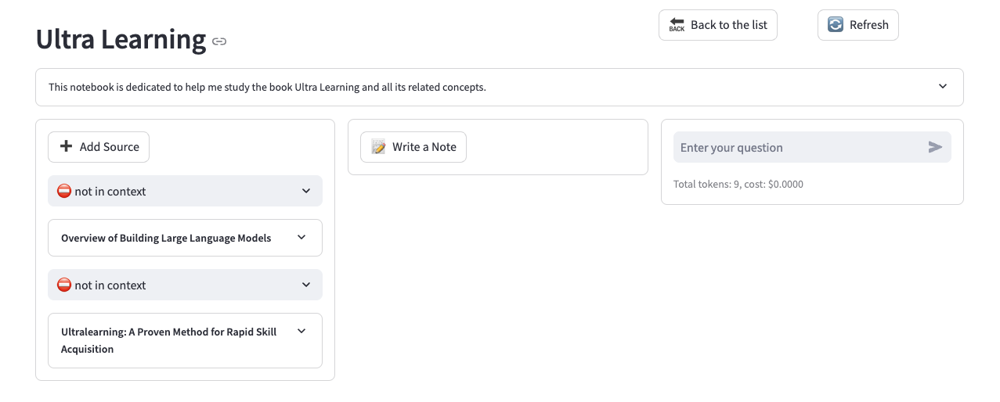

<a id="readme-top"></a>

<!-- [![Contributors][contributors-shield]][contributors-url] -->
[![Forks][forks-shield]][forks-url]
[![Stargazers][stars-shield]][stars-url]
[![Issues][issues-shield]][issues-url]
[![MIT License][license-shield]][license-url]
<!-- [![LinkedIn][linkedin-shield]][linkedin-url] -->


<!-- PROJECT LOGO -->
<br />
<div align="center">
  <a href="https://github.com/lfnovo/open-notebook">
    
  </a>

  <h3 align="center">Open Notebook</h3>

  <p align="center">
    An open source, privacy-focused alternative to Google's Notebook LM!
    <br />
    <a href="https://www.open-notebook.ai"><strong>Checkout our website »</strong></a>
    <br />
    <br />
    <a href="docs/SETUP.md">Setup</a>
    ·
    <a href="docs/USAGE.md">Usage</a>
    ·
    <a href="docs/TRANSFORMATIONS.md">Transformations</a>
    ·
    <a href="docs/PODCASTS.md">Podcasts</a>

  </p>
</div>


<!-- TABLE OF CONTENTS -->
<details>
  <summary>Table of Contents</summary>
  <ol>
    <li>
      <a href="#about-the-project">About The Project</a>
      <ul>
        <li><a href="#built-with">Built With</a></li>
      </ul>
    </li>
    <li>
      <a href="#setting-up">Setting Up</a>
      <ul>
        <li><a href="#prerequisites">Prerequisites</a></li>
        <li><a href="#installation">Installation</a></li>
      </ul>
    </li>
    <li><a href="#usage">Usage</a></li>
    <li><a href="#features">Features</a></li>
    <li><a href="#roadmap">Roadmap</a></li>
    <li><a href="#contributing">Contributing</a></li>
    <li><a href="#license">License</a></li>
    <li><a href="#contact">Contact</a></li>
    <li><a href="#acknowledgments">Acknowledgments</a></li>
  </ol>
</details>


<!-- ABOUT THE PROJECT -->
## About The Project




An open source, privacy-focused alternative to Google's Notebook LM. Why give Google more of our data when we can take control of our own research workflows?

In a world dominated by Artificial Intelligence, having the ability to think 🧠 and acquire new knowledge 💡, is a skill that should not be a privilege for a few, nor restricted to a single provider.

Open Notebook empowers you to manage your research, generate AI-assisted notes, and interact with your content—on your terms.

Learn more about our project at [https://www.open-notebook.ai](https://www.open-notebook.ai)


<p align="right">(<a href="#readme-top">back to top</a>)</p>


### Built With

[![Python][Python]][Python-url] [![SurrealDB][SurrealDB]][SurrealDB-url] [![LangChain][LangChain]][LangChain-url] [![Streamlit][Streamlit]][Streamlit-url]

<p align="right">(<a href="#readme-top">back to top</a>)</p>


## ⚙️ Setting Up

Go to the [Setup Guide](docs/SETUP.md) to learn how to set up the tool in details.

To setup with Docker/Portainer:

```yaml
version: '3'

services:
  surrealdb:
    image: surrealdb/surrealdb:v2
    ports:
      - "8000:8000"
    volumes:
      - surreal_data:/mydata
    command: start --log trace --user root --pass root rocksdb:/mydata/mydatabase.db
    pull_policy: always
    user: root

  open_notebook:
    image: lfnovo/open_notebook:latest
    ports:
      - "8080:8502"
    env_file:
      - ./docker.env
    depends_on:
      - surrealdb
    pull_policy: always

volumes:
  surreal_data:

```


Take a look at the [Open Notebook Boilerplate](https://github.com/lfnovo/open-notebook-boilerplate) repo with a sample of how to set it up for maximum feature usability. 


<p align="right">(<a href="#readme-top">back to top</a>)</p>

## Usage

Go to the [Usage](docs/USAGE.md) page to learn how to use all features.

<p align="right">(<a href="#readme-top">back to top</a>)</p>

## Features

- **Multi-Notebook Support**: Organize your research across multiple notebooks effortlessly.
- **Multi-model support**: Open AI, Anthropic, Gemini, Vertex AI, Open Router, Ollama.
- **Podcast Generator**: Automatically convert your notes into a podcast format.
- **Broad Content Integration**: Works with links, PDFs, EPUB, Office, TXT, Markdown files, YouTube videos, Audio files, Video files and pasted text.
- **AI-Powered Notes**: Write notes yourself or let the AI assist you in generating insights.
- **Integrated Search Engines**: Built-in full-text and vector search for faster information retrieval.
- **Fine-Grained Context Management**: Choose exactly what to share with the AI to maintain control.

<p align="right">(<a href="#readme-top">back to top</a>)</p>

## 🚀 New Features

### v0.0.9 - Ask your Documents and Citations  ❓

- Ask questions about your documents and get answers with citations

### v0.0.7 - Model Management  🗂️

- Manage your AI models and providers in a single interface
- Define default models for several tasks such as chat, transformation, embedding, etc
- Enabled support for Embedding models from Gemini, Vertex and Ollama

### v0.0.6 - ePub and Office files support 📄

You can now process ePub and Office files (Word, Excel, PowerPoint), extracting text and insights from them. Perfect for books, reports, presentations, and more.

### v0.0.5 - Audio and Video support 📽️

You can now process audio and video files, extracting transcripts and insights from them. Perfect for podcasts, interviews, lectures, and more.

### v0.0.4 - Podcasts  🎙️

You can now build amazing custom podcasts based on your own data. Customize your speakers, episode structure, cadence, voices, etc. 

Check out a sample using my own voice created on Eleven Labs and a interview format. 

[](https://www.youtube.com/watch?v=D-760MlGwaI)

You can generate your podcast in dozens of languages.

Head to the [Podcasts](docs/PODCASTS.md) page for more info

### v0.0.3 - Transformations ✨

We just release a much more powerful way to create more value from your sources.
Transformations enable you do extract an unlimited amount of insights from your content.
It's 100% customizable and you can extend it to your own needs, like Paper Analysis, Article Writing, etc.

Head to the [Transformations](docs/TRANSFORMATIONS.md) page for more info

### v0.0.2 - Several new providers are supported now:

- OpenAI
- Anthropic
- Open Router
- LiteLLM
- Vertex AI
- Ollama

### 📝 Notebook Page

Three intuitive columns to streamline your work:
1. **Sources**: Manage all research materials.
2. **Notes**: Create or AI-generate notes.
3. **Chat**: Chat with the AI, leveraging your content.

### ⚙️ Context Configuration

Take control of your data. Decide what gets sent to the AI with three context options:
- No context
- Summary only
- Full content

Plus, you can add your project description to help the AI provide more accurate and helpful responses.

### 🔍 Integrated Search for Your Items

Locate anything across your research with ease using full-text and vector-based search.

### 💬 Powerful open prompts

Jinja based prompts that are easy to customize to your own preferences.

<p align="right">(<a href="#readme-top">back to top</a>)</p>

<!-- ROADMAP -->
## Roadmap

- [ ] **Live Front-End Updates**: Real-time UI updates for a smoother experience.
- [ ] **Async Processing**: Faster UI through asynchronous content processing.
- [ ] **Cross-Notebook Sources and Notes**: Reuse research notes across projects.
- [ ] **Bookmark Integration**: Integrate with your favorite bookmarking app.
- ✅ **Multi-model support**: Open AI, Anthropic, Vertex AI, Open Router, Ollama, etc.
- ✅ **Insight Generation**: New tools for creating insights - [transformations](docs/TRANSFORMATIONS.md)
- ✅ **Podcast Generator**: Automatically convert your notes into a podcast format. 
- ✅ **Multiple Chat Sessions**: Juggle different discussions within the same notebook.
- ✅ **Enhanced Citations**: Improved layout and finer control for citations.
- ✅ **Better Embeddings & Summarization**: Smarter ways to distill information.

See the [open issues](https://github.com/lfnovo/open-notebook/issues) for a full list of proposed features (and known issues).

<p align="right">(<a href="#readme-top">back to top</a>)</p>


<!-- CONTRIBUTING -->
## Contributing

We would love your contributions! Specifically, we're looking for help with:
- **Front-End Development**: Improve the UI/UX by moving beyond Streamlit.
- **Testing & Bug Fixes**: Help make Open Notebook more robust.
- **Feature Development**: Let’s make the coolest note-taking tool together!

See more at [CONTRIBUTING](CONTRIBUTING.md)

<p align="right">(<a href="#readme-top">back to top</a>)</p>


<!-- LICENSE -->
## License

Open Notebook is MIT licensed. See the [LICENSE](LICENSE) file for details.

<p align="right">(<a href="#readme-top">back to top</a>)</p>


<!-- CONTACT -->
## Contact

Luis Novo - [@lfnovo](https://twitter.com/lfnovo)

<p align="right">(<a href="#readme-top">back to top</a>)</p>


<!-- ACKNOWLEDGMENTS -->
## Acknowledgments

This project uses some amazing third-party libraries

* [Podcastfy](https://github.com/souzatharsis/podcastfy) - Licensed under the Apache License 2.0

<p align="right">(<a href="#readme-top">back to top</a>)</p>


<!-- MARKDOWN LINKS & IMAGES -->
<!-- https://www.markdownguide.org/basic-syntax/#reference-style-links -->
[contributors-shield]: https://img.shields.io/github/contributors/lfnovo/open-notebook.svg?style=for-the-badge
[contributors-url]: https://github.com/lfnovo/open-notebook/graphs/contributors
[forks-shield]: https://img.shields.io/github/forks/lfnovo/open-notebook.svg?style=for-the-badge
[forks-url]: https://github.com/lfnovo/open-notebook/network/members
[stars-shield]: https://img.shields.io/github/stars/lfnovo/open-notebook.svg?style=for-the-badge
[stars-url]: https://github.com/lfnovo/open-notebook/stargazers
[issues-shield]: https://img.shields.io/github/issues/lfnovo/open-notebook.svg?style=for-the-badge
[issues-url]: https://github.com/lfnovo/open-notebook/issues
[license-shield]: https://img.shields.io/github/license/lfnovo/open-notebook.svg?style=for-the-badge
[license-url]: https://github.com/lfnovo/open-notebook/blob/master/LICENSE.txt
[linkedin-shield]: https://img.shields.io/badge/-LinkedIn-black.svg?style=for-the-badge&logo=linkedin&colorB=555
[linkedin-url]: https://linkedin.com/in/lfnovo
[product-screenshot]: images/screenshot.png
[Streamlit]: https://img.shields.io/badge/Streamlit-FF4B4B?style=for-the-badge&logo=streamlit&logoColor=white
[Streamlit-url]: https://streamlit.io/
[Python]: https://img.shields.io/badge/Python-3776AB?style=for-the-badge&logo=python&logoColor=white
[Python-url]: https://www.python.org/
[LangChain]: https://img.shields.io/badge/LangChain-3A3A3A?style=for-the-badge&logo=chainlink&logoColor=white
[LangChain-url]: https://www.langchain.com/
[SurrealDB]: https://img.shields.io/badge/SurrealDB-FF5E00?style=for-the-badge&logo=databricks&logoColor=white
[SurrealDB-url]: https://surrealdb.com/
