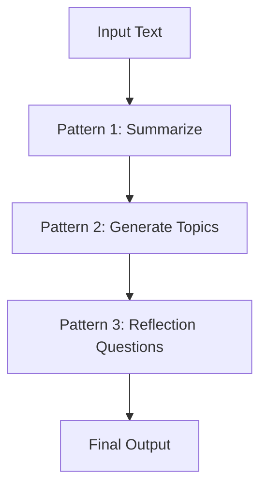

# Transformations Guide

**Unleashing the hidden knowledge of your content**

Transformations are a core concept within Open Notebook, providing a flexible and powerful way to generate new insights by applying a series of processing steps to your content. Based on the Fabric framework, Transformations allow you to customize how information is distilled, summarized, and enriched, opening up new ways to understand and engage with your research.


### What is a Transformation?

A **Transformation** is a sequence of operations that modifies text input to produce a different output. Whether you're summarizing an article, generating key insights, or creating reflective questions, Transformations allow you to automate and enrich the processing of your content. Each transformation is composed of one or more blocks called **Patterns**, which can be linked in a chain to achieve complex results.

Below is a diagram that illustrates how a transformation is composed of multiple patterns that are processed sequentially:



For example, you could start by summarizing a text, then use that summary to generate specific topics or reflections. By applying these layered processing steps, Transformations help you generate deeper insights and maximize the value of your content.

### Setting Up Transformations

To set up your own Transformations, you'll define them in the `transformations.yaml` file. Below is an example setup:

```yaml
source_insights:
  - name: "Summarize"
    insight_type: "Content Summary"
    description: "Summarize the content"
    patterns:
      - patterns/makeitdense
      - patterns/summarize
  - name: "Key Insights"
    insight_type: "Key Insights"
    description: "Extracts a list of the Key Insights of the content"
    patterns:
      - patterns/keyinsights
  - name: "Make it Dense"
    insight_type: "Dense Representation"
    description: "Create a dense representation of the content"
    patterns:
      - patterns/makeitdense
  - name: "Analyze Paper"
    insight_type: "Paper Analysis"
    description: "Analyze the paper and provide a quick summary"
    patterns:
      - patterns/analyze_paper
  - name: "Reflection"
    insight_type: "Reflection Questions"
    description: "Generates a list of insightful questions to provoke reflection"
    patterns:
      - patterns/reflection_questions
```

Once you've defined your transformation, make sure to add the corresponding prompts to the `prompts/patterns` folder. Here's an example of a transformation prompt:

```jinja


# IDENTITY and PURPOSE

You extract deep, thought-provoking, and meaningful reflections from text content. You are especially focused on themes related to the human experience, such as the purpose of life, personal growth, the intersection of technology and humanity, artificial intelligence's societal impact, human potential, collective evolution, and transformative learning. Your reflections aim to provoke new ways of thinking, challenge assumptions, and provide a thoughtful synthesis of the content.

# STEPS

- Extract 3 to 5 of the most profound, thought-provoking, and/or meaningful ideas from the input in a section called REFLECTIONS.
- Each reflection should aim to explore underlying implications, connections to broader human experiences, or highlight a transformative perspective.
- Take a step back and consider the deeper significance or questions that arise from the content.

# OUTPUT INSTRUCTIONS

- The output section should be labeled as REFLECTIONS.
- Each bullet point should be between 20-25 words.
- Avoid repetition in the phrasing and ensure variety in sentence structure.
- The reflections should encourage deeper inquiry and provide a synthesis that transcends surface-level observations.
- Use bullet points, not numbered lists.
- Every bullet should be formatted as a question that elicits contemplation or a statement that offers a profound insight.

# INPUT

{{input_text}}

# OUTPUT
```

### Important Tips

- Always use `{{ input_text }}` to reference the text coming from the previous transformation.
- You can use `include` statements, like in the example above, to insert common instructions across all your patterns.
- Paths that start with `patterns/` will point to a corresponding `.jinja` file in the `patterns` folder.
- Any item that doesn't follow the `patterns/` format will be interpreted as a command (refer to `command.jinja` for clarity).


### Call for Contributions

Have an idea for an amazing Transformation? We'd love to see your creativity! Please submit a pull request with your favorite transformations to help expand our library. Whether it's summarization, content analysis, or something entirely unique, your contributions will help us all get more out of our research!Leveraging Transformations in Open Notebook

Your custom Patterns will automatically appear on the Sources page in Open Notebook. This makes it easy to select and apply them to your content as you research and explore. Note that we'll soon be adding **Note patterns** as well, making it even easier to transform not just sources, but also your own notes and thoughts.


### Sky's the Limit

Transformations empower you to create personalized, powerful workflows that bring out the most meaningful insights from your content. Whether you're working with articles, papers, notes, or other media, you can craft specific and meaningful outcomes tailored to your research goals. Start experimenting today and see just how transformative your content can become!
